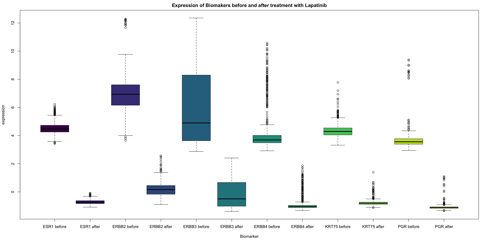

```{r setup, include=FALSE}
knitr::opts_chunk$set(echo = TRUE)
#library packages
library(cluster) 
library(dendextend)
library(dplyr)
library(factoextra)
library(fpc)
library(ggplot2)
library(ggpubr)
library(matrixTests)
library(pheatmap)
library(RColorBrewer)
library(viridis)
library(plotly)
library(ggrepel)
library(compare)
library(data.table)
library(matrixTests)

```


## data loading
```{r, echo=FALSE}


wd = getwd()

NCI_TPW_gep_treated = readRDS(paste0(wd, "/Data/NCI_TPW_gep_treated.rds"))
NCI_TPW_gep_untreated = readRDS(paste0(wd, "/Data/NCI_TPW_gep_untreated.rds"))
Metadata = read.delim(paste0(wd, "/Data/NCI_TPW_metadata.tsv"), header = TRUE, sep = "\t", stringsAsFactors = TRUE)
Cellline_Annotation = read.delim(paste0(wd, "/Data/cellline_annotation.tsv"), header = TRUE, sep = "\t", stringsAsFactors = TRUE)
Drug_Annotation = read.delim(paste0(wd, "/Data/drug_annotation.tsv"), header = TRUE, sep = "\t", stringsAsFactors = TRUE)
CCLE_mutations = readRDS(paste0(wd, "/Data/CCLE_mutations.rds"))
CCLE_copynumber = readRDS(paste0(wd, "/Data/CCLE_copynumber.rds"))
CCLE_basalexpression = readRDS(paste0(wd, "/Data/CCLE_basalexpression.rds"))
NegLogGI50 = as.data.frame(readRDS(paste0(wd, "/Data/NegLogGI50.rds")))
Treated = data.frame(NCI_TPW_gep_treated)
Untreated = data.frame(NCI_TPW_gep_untreated)
```

## data scaling
After checking for normalization, we scaled our data in the first place to provide the scaled data for further analysis.
```{r ,echo=FALSE}
list = list(Treated,Untreated)
nlist = lapply(list,scale)
Treated = as.data.frame(nlist[[1]])
Untreated = as.data.frame(nlist[[2]])
Fold_Change = Treated - Untreated
Fold_Change = data.frame(Fold_Change)
rm(NCI_TPW_gep_treated,NCI_TPW_gep_untreated,list,nlist)

```

# 1. Broad analysis

###Boxplots (already normalized)
This step was done before scaling the data. The boxplots showed a deviation which is the reason for scaling the data.
```{r, echo=FALSE}
boxplot(Treated)
```

```{r, echo=FALSE}
boxplot(Untreated)
```


```{r,echo=FALSE}
boxplot(Treated,  ylab = "Gene expression profile", main = "Treated genexpressionprofiles",xaxt = "n")

boxplot(Untreated, ylab = "Gene expression profile", main = "Untreated genexpressionprofiles",xaxt = "n")

boxplot(Treated[,1:10], ylab = "Gene expression profile", main = "First 10 reated genexpressionprofiles")
```


```{r coloured boxplots, creating a susbet of Metadata based on the amount of tested genes in Treated,echo=FALSE}
Treated1 = readRDS(paste0(wd, "/Data/NCI_TPW_gep_treated.rds"))
df = data.frame(t(Treated1))
df.data <- data.frame(sample = rownames(df))
adjustedMeda = subset(Metadata, sample %in% intersect(Metadata$sample, df.data$sample))
rm(df,df.data, Treated1)
palette(rainbow(15))
boxplot(Treated, border=adjustedMeda$drug,xlab= "Different Drugs" ,ylab = "Gene expression profile", main = "Teated genexpressionprofiles",xaxt ="n")
```

### Densityplot 
The abline shows the 3 quantiles (      25%       50%       75%    )
```{r,echo=FALSE}
NCI_TPW_gep_treated = readRDS(paste0(wd, "/Data/NCI_TPW_gep_treated.rds"))
NCI_TPW_gep_untreated = readRDS(paste0(wd, "/Data/NCI_TPW_gep_untreated.rds"))
plot(density(NCI_TPW_gep_treated), "Densityplot Treated vs Untreated")
lines(density(NCI_TPW_gep_untreated), col = "indianred2")
legend("topright", legend = c("treated", "untreated"), col = c("black", "indianred2"), pch = 20)
abline(v = quantile(NCI_TPW_gep_treated)[2:4], col = c("lightblue", "blue",  "orange"), lty = 2)
```


###k-means clustering
To look for clusters in the raw data we performed a k-menas clustering and searched for potentially clusters.
```{r, echo=FALSE}
# Performing a k-means on Treated
#Determining the number of clusters
topVarTreated = apply(Treated, 1, var)
summary(topVarTreated)

# Using the most variable, thus informative genes
topVarTreated75 = Treated[topVarTreated > quantile(topVarTreated, probs = 0.75), ]
dim(topVarTreated75)

```

```{r, echo=FALSE}
km = kmeans(x = t(topVarTreated75), centers = 3, nstart = 10)
km$tot.withinss
```

```{r, echo=FALSE}
km = kmeans(x = t(topVarTreated75), centers = 2, nstart = 10)
km$tot.withinss
```

```{r,echo=FALSE}
#running a loop for the best n (searching for "ellbow")
wss = sapply(2:7, function(k) {
kmeans(x = t(topVarTreated75), centers = k)$tot.withinss})            
plot(2:7, wss, type = "b", pch = 19, xlab = "Number of clusters K", ylab = "Total within-clusters sum of squares", main = "Determining the amount of clusters from Treated")
```
As we wanted an "ellbow"to get a good result we can say in a way that our data are not really good to cluster.
To look in a other way, we also provided the clusters by the silhouette-method.
```{r,echo=FALSE}
# Using the silhouett method
D = dist(t(topVarTreated75))
km = kmeans(x = t(topVarTreated75), centers = 10, nstart = 10)
s = silhouette(km$cluster, D)
plot(s)
```


###PCA
```{r}
pca <- prcomp(t(Fold_Change), scale = TRUE)

```
```{r}
# sdev calculates variation each PC accounts for
pca.var <- pca$sdev^2  
# since percentages make more sense then normal variation values
# calculate % or variation, which is much more interesing
pca.var.per <- round(pca.var/sum(pca.var)*100, 1) 

barplot(pca.var.per, main = "Scree plot", xlab = "Principal Components", ylab = "% variation")
plot(pca.var.per[1:10], main = "Elbow plot", type = "l", xlab = "Principal Components", ylab = "% variation")
plot(cumsum(pca.var.per[1:15]), main = "cumulative variation", type = "l", xlab = "Principal Components", ylab = "% variation") 

```
```{r}
#creating data frame with all pcs 
#cleaning up sample names as they differed between matrices 
pca.data <- data.frame(pca$x)
rownames(pca.data) <- gsub(x = rownames(pca.data), pattern = "X786", replacement = "786")
pca.data <- cbind(sample =rownames(pca.data), pca.data)

```
```{r}
## get names of top 10 genes that contribute most to pc1
loading_scores_1 <- pca$rotation[,1]
gene_score <- abs(loading_scores_1) ## sort magnitude
gene_score_ranked <- sort(gene_score, decreasing = TRUE)


top_10_genes <- names(gene_score_ranked[1:10])
top_10_genes # show names of top 10 genes
```
```{r}
### Metadata color matrix for coloring 
Metadata$sample <- gsub(x = Metadata$sample, pattern = "-", replacement = ".")

metad.cl <- subset(Metadata, Metadata$sample %in% pca.data$sample) 
## adjust row length of metadata to pca.data


metad.cl$mechanism <- Drug_Annotation$Mechanism[match(metad.cl$drug, Drug_Annotation$Drug)]
metad.cl$msi <- Cellline_Annotation$Microsatellite_instability_status[match(metad.cl$cell, Cellline_Annotation$Cell_Line_Name)]

```
```{r}

# plotting all informative PCs
#color vectors for coloring by drug and tissue
viridis <- viridis(9)
color_tissue = viridis[metad.cl$tissue]
tissue <- levels(metad.cl$tissue)

magma <- magma(15)
color_drug = magma[metad.cl$drug]
drug <- levels(metad.cl$drug)


## colored by drug
#plot PC1 and PC2
plot(pca$x[,1], 
     pca$x[,2], 
     col = color_drug,
     pch = 19, 
     xlab = paste("PC1 (",pca.var.per[1],"%)"), 
     ylab = paste("PC2 (",pca.var.per[2],"%)"))
#create legend
legend("topleft", 
       legend = drug, 
       col = magma, 
       pch = 19, 
       xpd = "TRUE",
       bty = "n",
       cex = 0.75
)
#create title
mtext("PCA of Fold Change  colored by drug", 
      side = 3, 
      line = -2,
      cex = 1.2,
      font = 2, 
      outer = TRUE)

#plot PC2 and PC3
plot(pca$x[,2], 
     pca$x[,3], 
     col = color_drug,
     pch = 19, 
     xlab = paste("PC2 (",pca.var.per[2],"%)"), 
     ylab = paste("PC3 (",pca.var.per[3],"%)"))
#create legend
legend("right", 
       legend = drug, 
       col = magma, 
       pch = 19, 
       xpd = "TRUE",
       bty = "n",
       cex = 0.75,
       inset = c(0, 2)
)
#create title
mtext("PCA of Fold Change  colored by drug", 
      side = 3, 
      line = -2,
      cex = 1.2,
      font = 2, 
      outer = TRUE)


## colored by tissue
#plot PC1 and PC2
plot(pca$x[,1], 
     pca$x[,2], 
     col = color_tissue,
     pch = 19, 
     xlab = paste("PC1 (",pca.var.per[1],"%)"), 
     ylab = paste("PC2 (",pca.var.per[2],"%)"))
#create legend
legend("topleft", 
       legend = tissue, 
       col = viridis, 
       pch = 19, 
       xpd = "TRUE",
       bty = "n",
       cex = 0.75
)
#create title
mtext("PCA of Fold Change  colored by tissue", 
      side = 3, 
      line = -2,
      cex = 1.2,
      font = 2, 
      outer = TRUE)

#plot PC2 and PC3
plot(pca$x[,2], 
     pca$x[,3], 
     col = color_tissue,
     pch = 19, 
     xlab = paste("PC2 (",pca.var.per[2],"%)"), 
     ylab = paste("PC3 (",pca.var.per[3],"%)"))
#create legend
legend("right", 
       legend = tissue, 
       col = viridis, 
       pch = 19, 
       xpd = "TRUE",
       bty = "n",
       cex = 0.75,
       inset = c(0, 2)
)
#create title
mtext("PCA of Fold Change  colored by tissue", 
      side = 3, 
      line = -2,
      cex = 1.2,
      font = 2,
      outer = TRUE)

```


# 2. Specific analysis: lapatinib

##Analysis of the biomarker and t-test between treated and untreated cells


###Expression of biomakers before and after the treatment with Lapatinib.
```{r}
Treated_t<-data.frame(t(Treated))
Untreated_t<-data.frame(t(Untreated))
```

###boxplot of biomakers before and after treatment with Lapatinib




###searching for own biomarkers
```{r}
LapatinibUntreated<-select(Untreated, contains("Lapa"))
LapatinibTreated<-select(Treated, contains("Lapa"))
before=as.matrix(LapatinibUntreated)
after=as.matrix(LapatinibTreated)


LapUn<-data.frame(t(before))
LapTreat<-data.frame(t(after))

#searching for our own biomarker
Treat<-colMeans(LapTreat, na.rm = TRUE)
Untreat<-colMeans(LapUn, na.rm = TRUE)
dim(Treat)
ut<-(Treat-Untreat)
ut_sort<-sort(ut, decreasing = TRUE)
head(ut_sort)
```

```{r, fig.height=5, fig.width=12, message=TRUE, paged.print=TRUE}
library(viridis)
boxplot(LapTreat$GDF15,LapUn$GDF15,
        LapTreat$NUPR1, LapUn$NUPR1, 
        LapTreat$DDIT3, LapUn$DDIT3, 
        LapTreat$TRIB3, LapUn$TRIB3,
        LapTreat$ATF3,LapUn$ATF3, 
        LapTreat$ASNS, LapUn$ASNS, 
        col = viridis(12),
        names = c("GDF15", " ", "NUPR1", " ", "DDIT3", " " ,"TRIB3"," ", "ATF3", " ", "ASNS",  " "),
        main="Expression of Biomakers before and after treatment with Lapatinib", 
        xlab="Biomarker",
        ylab="expression")

```
### creating some date
```{r}
breastcells<-subset(Metadata, tissue == "Breast")
breast<-subset(CCLE_basalexpression, breastcells$cell  %in%  colnames(CCLE_basalexpression))
tbreastcells<-data.frame(t(breast))
biomarker_genes <-c("ESR1", "ERBB2", "ERBB3", "ERBB4", "KRT75", "PGR")
breast_marker <- c(tbreastcells$ESR1,tbreastcells$ERBB2, tbreastcells$ERBB3, tbreastcells$ERBB4, tbreastcells$KRT75, tbreastcells$PGR )
breast_marker_matrix <- data.frame(tbreastcells$ESR1,tbreastcells$ERBB2, tbreastcells$ERBB3, tbreastcells$ERBB4, tbreastcells$KRT75, tbreastcells$PGR )
```

###overview of the basalexpression of our biomarkers
```{r}
cells<-c(rep('ESR1',45),rep('ERBB2',45),rep('ERBB3',45),rep('ERBB4',45),rep('KRT75',45),rep('PGR',45))
expression<-c(tbreastcells$ESR1,tbreastcells$ERBB2, tbreastcells$ERBB3, tbreastcells$ERBB4, tbreastcells$KRT75, tbreastcells$PGR )
df_breast<-data.frame(cells,expression)
plot(expression ~ cells, data=df_breast)
```

###ggboxplot of basalexpression of biomarkers in breast cells

Kruskal-Wallis test
The null hypothesis is: there is no difference between the groups
```{r}
ggboxplot(df_breast, x="cells", y="expression", color = "cells",
          add = "jitter", legend = "none")+
  rotate_x_text(angle = 45)+
  stat_compare_means(method = "kruskal.test", label.y = 12)+        # Add global annova p-value
  stat_compare_means(label = "p.signif", method = "t.test",
                     ref.group = ".all.", hide.ns = TRUE)      # Pairwise comparison against all
```


###pheatmap of the basalexpression
to detect highly over expressed genes 
```{r Basalexpression2}
pheatmap(CCLE_basalexpression,
         show_rownames = FALSE, 
         show_colnames = FALSE, 
         color = viridis(4),
         drop_levels = TRUE, 
         clustering_method = "ward.D2", 
         scale="row")
```

###pheatmap of the biomarker in breast cells
The genes ERBB2 and ERBB3 showed the highest expression.
```{r}
pheat_breast<-pheatmap(breast_marker_matrix ,
                      show_rownames = FALSE, 
                      show_colnames = TRUE, 
                      cutree_cols = 4, 
                      cutree_rows = 3, 
                      color = viridis(4),
                      drop_levels = TRUE, 
                      clustering_method = "ward.D2", 
                      scale="row")
pheat_breast
```

###pheatmap of all genes in breast cells
This serves as an over view. Yellow fields are highly over expressed.
```{r}
all_genes_cells<-pheatmap(breast, 
         show_rownames = FALSE, 
         show_colnames = TRUE, 
         color = viridis(4),
         drop_levels = TRUE, 
         clustering_method = "ward.D2", 
         scale="row")
all_genes_cells
```

###boxplot of biomarkers in basalexpression
The boxplot shows the overexpression of the biomakers in the basalexpression

```{r}
t_basalexpression<-data.frame(t(CCLE_basalexpression))
biomarker_genes <-c("ESR1", "ERBB2" ,"ERBB3", "ERBB4", "KRT75", "PGR")
Matrix_biomarker<-c(t_basalexpression$ESR1, t_basalexpression$ERBB2, t_basalexpression$ERBB3, t_basalexpression$ERBB4, t_basalexpression$KRT75, t_basalexpression$PGR)
summary(Matrix_biomarker)
min(Matrix_biomarker)
max(Matrix_biomarker)
boxplot(Matrix_biomarker)
```


*setting a threshold to define overexpressed genes*
```{r }
rmv.rows = apply(CCLE_basalexpression, 1, function(x) {
  sum(x<14)})
which(rmv.rows <14)
highest_expression = CCLE_basalexpression[-which(rmv.rows <14), ]  
rm(rmv.rows)
                                   
```


###pheatmap of highly expressed genes
```{r}
#install.packages("viridisLite")
pheatmap(highest_expression,
         show_rownames = FALSE, 
         color=viridis(4),
         show_colnames = FALSE, 
         drop_levels = TRUE, 
         clustering_method = "ward.D2", 
         scale="row") 
```

###searching for our own biomarkers
This command displays the six most expressed genes of basal expression.
```{r}
basalexpression <- data.frame(CCLE_basalexpression)
b<-apply(basalexpression,1, max)
highest_basalexpression<-sort(b, decreasing = TRUE)
head(highest_basalexpression)
```

###boxplot of highly expressed genes before and after treatment with Lapatinib
```{r }
boxplot(Untreated_t$COX6C, Treated_t$COX6C, 
        Untreated_t$'2', Treated_t$'2',
        Untreated_t$RPS11, Treated_t$RPS11, 
        Untreated_t$GAPDH, Treated_t$GAPDH,
        Untreated_t$MT2A, Treated_t$MT2A, 
        Untreated_t$TUBA1B, Treated_t$TUBA1B,
        col = viridis(12),
        names = c("COX6C before", "COX6C after", 
                  "2 before", "2 after", 
                  "RPS11 before", "RPS11 after", 
                  "GAPDH before","GAPDH after", 
                  "$MT2A before", "$MT2A after", 
                  "TUBA1B before",  "TUBA1B after"),
        main="Expression of Biomakers before and after treatment with Lapatinib", 
        xlab="Biomarker",
        ylab="expression")
```


##paired t-test between the Lapatinib treated und untreated data
###genome wide paired t-test
```{r }
#genome wide paired t-test
library(dplyr)
LapatinibUntreated<-select(Untreated, contains("Lapa"))
LapatinibTreated<-select(Treated, contains("Lapa"))
before=as.matrix(LapatinibUntreated)
after=as.matrix(LapatinibTreated)
t.test(before, after, paired=TRUE)

```

###ggboxplot to compare the treated an untreated data
```{r }
#variance analysis before and after treatment
my_data <- data.frame( 
               group = rep(c("before", "after")),
                expression = c(before,  after))
               


library(ggpubr)
ggboxplot(my_data, x = "group", y = "expression", 
                    color = "group", palette = c("#00AFBB", "#E7B800"),
                    order = c("before", "after"),
                    ylab = "expression", xlab = "group")

```
The ggboxplots "before" and "after" are very similar. This suggests that lapatinib only modifies the expression of fewer genes. The theory makes sense because in cancer cells only certain genes, such as proliferation genes, are altered.


###t-test over each column 
-> paired t-test over cell lines

```{r}
#t-test over each column -> cell lines
library(matrixTests)
col_t_paired(before, after, alternative = "two.sided", mu = 0,conf.level = 0.95)

```

### paired t-test over genes, increased confidence level (99%) to minimize false positive
```{r}
###t-test over each row


row_t_test<-as.data.frame(row_t_paired(before, after, alternative = "two.sided", mu = 0,conf.level = 0.99))
summary(row_t_test$pvalue)
```


##k-means
```{r}
LapatinibFold = select(Fold_Change, contains("Lapa"))

#Determining the number of clusters
topVarFold = apply(LapatinibFold, 1, var)
summary(topVarFold)

# Using the most variable, thus informative genes
topVarFold75 = LapatinibFold[topVarFold > quantile(topVarFold, probs = 0.75), ]
dim(topVarFold75)

km = kmeans(x = t(topVarFold75), centers = 2, nstart = 10)
km$tot.withinss

km = kmeans(x = t(topVarFold75), centers = 3, nstart = 10)
km$tot.withinss

#running a loop for the best n (searching for "ellbow")
wss = (sapply(2:7, function(k) {
  kmeans(x =t(topVarFold75), centers = k)$tot.withinss})  )            
plot(2:7, wss, type = "b", pch = 19, xlab = "Number of clusters K", ylab = "Total within-clusters sum of squares", main = "Determining the amount of clusters from Foldchange")
```

```{r}
# Using the silhouett method
D = dist(t(topVarFold75))
km = kmeans(x = t(topVarFold75), centers = 3, nstart = 10)
s = silhouette(km$cluster, D)
plot(s)
```

```{r}
#plot kmeans
clus <- kmeans(topVarFold75, centers=3)
clusplot(topVarFold75, clus$cluster, color=TRUE, shade=TRUE, labels=1, lines=0, col.clus = c("purple", "pink", "lightseagreen"), main = "K-means Plot", col.p = c("purple", "pink", "lightseagreen"))

```

```{r}
#dendrogram
cor.mat = cor(topVarFold75, method = "spearman")
cor.dist = as.dist(1 - cor.mat)
cor.hc = hclust(cor.dist, method = "ward.D2")
cor.hc = as.dendrogram(cor.hc)
#cor.hc %>% set("labels_col", value = c("purple", "pink", "lightseagreen"), k = 3) %>%  plot(main = "Color labels \n by cluster", horiz = TRUE)


#PCA
pca = prcomp(topVarFold75, center = T, scale. = T)  
plot(pca, type = "l") #First two componets explain most of the variability in the data
plot(pca$rotation[, 1], pca$rotation[, 2], col = c("maroon1", "turquoise3"), pch = 19, xlab = "PC1", ylab = "PC2")
```

## PCA
```{r}
L_fc <- select(Fold_Change, contains("Lapa"))

# PCA
pca <- prcomp(t(L_fc), scale = TRUE)

```
```{r}
pca.var <- pca$sdev^2  # sdev calculates variation each PC accounts for
pca.var.per <- round(pca.var/sum(pca.var)*100, 1) 
# since percentages make more sense then normal variation values
# calculate % or variation, which is much more interesing

barplot(pca.var.per, main = "Scree plot", xlab = "Principal Components", ylab = "% variation")
plot(pca.var.per[1:10], main = "Elbow plot", type = "l", xlab = "Principal Components", ylab = "% variation")
plot(cumsum(pca.var.per[1:15]), main = "cumulative variation", type = "l", xlab = "Principal Components", ylab = "% variation") 
```
```{r}
pca.data <- data.frame(pca$x)
rownames(pca.data) <- gsub(x = rownames(pca.data), pattern = "X786", replacement = "786")
pca.data <- cbind(sample =rownames(pca.data), pca.data)

```


```{r}
## get names of top 10 genes that contribute most to pc1
loading_scores_1 <- pca$rotation[,1]

gene_score <- abs(loading_scores_1) ## sort magnitude
gene_score_ranked <- sort(gene_score, decreasing = TRUE)

top_10_genes <- names(gene_score_ranked[1:10])
top_10_genes # show names of top 10 genes

```
```{r}
### Metadata matrix for coloring 
Metadata$sample <- gsub(x = Metadata$sample, pattern = "-", replacement = ".")
metad.cl <- subset(Metadata, sample %in% intersect(Metadata$sample, pca.data$sample))  
metad.cl$msi <- Cellline_Annotation$Microsatellite_instability_status[match(metad.cl$cell, Cellline_Annotation$Cell_Line_Name)]
metad.cl$inoculation_d <- Cellline_Annotation$Inoculation_Density[match(metad.cl$cell, Cellline_Annotation$Cell_Line_Name)]
metad.cl$doubling_time <- Cellline_Annotation$Doubling_Time[match(metad.cl$cell, Cellline_Annotation$Cell_Line_Name)]
metad.cl$cancer_type <- Cellline_Annotation$Cancer_type[match(metad.cl$cell, Cellline_Annotation$Cell_Line_Name)]

```

```{r}
#color vectors for coloring by msi and tissue
colormsi <- brewer.pal(3, "Set1")
color_msi = colormsi[metad.cl$msi]
msi <- levels(metad.cl$msi)

magma <- magma(9)
color_tissue = magma[metad.cl$tissue]
tissue <- levels(metad.cl$tissue)


## colored by msi
#plot PC1 and PC2
plot(pca$x[,1], 
     pca$x[,2], 
     col = color_msi,
     pch = 19, 
     xlab = paste("PC1 (",pca.var.per[1],"%)"), 
     ylab = paste("PC2 (",pca.var.per[2],"%)"))
#create legend
legend("bottomright", 
       legend = msi, 
       col = colormsi, 
       pch = 19, 
       xpd = "TRUE",
       bty = "n",
       cex = 0.75
)
#create title
mtext("PCA of Fold Change colored by MSI", 
      side = 3, 
      line = -2,
      cex = 1.2,
      font = 2, 
      outer = TRUE)

#plot PC2 and PC3
plot(pca$x[,2], 
     pca$x[,3], 
     col = color_msi,
     pch = 19, 
     xlab = paste("PC2 (",pca.var.per[2],"%)"), 
     ylab = paste("PC3 (",pca.var.per[3],"%)"))
#create legend
legend("topleft", 
       legend = msi, 
       col = colormsi, 
       pch = 19, 
       xpd = "TRUE",
       bty = "n",
       cex = 0.75
)
#create title
mtext("PCA of Fold Change colored by MSI", 
      side = 3, 
      line = -2,
      cex = 1.2,
      font = 2, 
      outer = TRUE)


##colored by tissue
#plot PC1 and PC2
plot(pca$x[,1], 
     pca$x[,2], 
     col = color_tissue,
     pch = 19, 
     xlab = paste("PC1 (",pca.var.per[1],"%)"), 
     ylab = paste("PC2 (",pca.var.per[2],"%)"))
#create legend
legend("bottomright", 
       legend = tissue, 
       col = magma, 
       pch = 19, 
       xpd = "TRUE",
       bty = "n",
       cex = 0.75
)
#create title
mtext("PCA of Fold Change colored by tissue", 
      side = 3, 
      line = -2,
      cex = 1.2,
      font = 2, 
      outer = TRUE)

#plot PC2 and PC3
plot(pca$x[,2], 
     pca$x[,3], 
     col = color_tissue,
     pch = 19, 
     xlab = paste("PC2 (",pca.var.per[2],"%)"), 
     ylab = paste("PC3 (",pca.var.per[3],"%)"))
#create legend
legend("bottomleft", 
       legend = tissue, 
       col = magma, 
       pch = 19, 
       xpd = "TRUE",
       bty = "n",
       cex = 0.75
)
#create title
mtext("PCA of Fold Change colored by tissue", 
      side = 3, 
      line = -2,
      cex = 1.2,
      font = 2, 
      outer = TRUE)


```

### pearson and spearman correlation
```{r}
# Pearson correlation
cor(Cellline_Annotation$Doubling_Time, Cellline_Annotation$Inoculation_Density, method = "pearson")
```

```{r}
# Spearman correlation
cor(Cellline_Annotation$Doubling_Time, Cellline_Annotation$Inoculation_Density, method = "spearman")
```
higher value with spearman method

```{r}
plot(Cellline_Annotation$Doubling_Time, Cellline_Annotation$Inoculation_Density, pch= 16, col= "blue", main = "Spearman correlation between Doubling Time and Inoculation Density", xlab = "Doubling Time", ylab = "Inoculation Density")
lm(Cellline_Annotation$Inoculation_Density~ Cellline_Annotation$Doubling_Time)

abline(lm(Cellline_Annotation$Inoculation_Density ~ Cellline_Annotation$Doubling_Time), col = "red", lwd = 2)
```

# 3. Main questions
##Question 1: Pedicted GI50-values
As we mentioned in our presentation, we want to create a model to predict GI50-values thus to predict, if Lapatinib is a good choice.,
The first linear model trys to predict the G-50 value under the data of the doubling time.
```{r}

Fold_ChangeLap = select(Fold_Change, contains("Lapa"))
NegLogGI50Lap = NegLogGI50[9,]
means = colMeans(Fold_ChangeLap)
Fold_Changemeans = as.data.frame(t(means))

a2 = gsub(x = colnames (Fold_Changemeans), pattern = "_lapatinib_10000nM_24h", replacement = "")
colnames(Fold_Changemeans) = a2

a3 = gsub(x = a2, pattern = "X7", replacement = "7")
colnames(Fold_Changemeans) = a3


a1 = gsub(x = colnames (NegLogGI50Lap), pattern = "-", replacement = ".")
colnames(NegLogGI50Lap) = a1

c1 = rbind(a1,NegLogGI50Lap)
c2 = rbind(a3,Fold_Changemeans)

c1 = t(c1)
c2 = t(c2)

c1 =as.data.frame(c1)
c2 =as.data.frame(c2)


c3 = subset(c1, `1` %in% intersect(c1$`1`, c2$V1))
c4 = as.numeric(as.character(c3$lapatinib))
adjustedNeglogI50Lap = as.data.frame(c4)


Fold_Changemeans = as.data.frame(t(Fold_Changemeans))

combined1 = cbind(adjustedNeglogI50Lap, Fold_Changemeans)

names1 = c( "NegLogI50Lap","Fold_Changemeans")
colnames(combined1) = names1
                      
lmFold = lm(NegLogI50Lap ~ Fold_Changemeans, data = combined1)

summary(lmFold)

qqnorm(lmFold$residuals, main = "Test for normaldistribution of residuals")
qqline(lmFold$residuals)

plot(combined1$NegLogI50Lap, lmFold$fitted.values, pch = 20, col = "blue", xlab = "Real values", 
     ylab = "Predicted values", main = "Comparison: real and predicted values ~ linear regression (Fold_Changemeans)")
abline(0, 1, col = "red")

cor(combined1$NegLogI50Lap,combined1$Fold_Changemeans)

#Split the data (Training - Testing)

n = nrow(combined1)
rmse1 = sqrt(1/n * sum(lmFold$residuals^2))
rmse1

i1.train = sample(1:nrow(combined1), 44)

dat1.train = combined1[i1.train, ]
dat1.test = combined1[-i1.train, ]

l1.train = lm(NegLogI50Lap ~ Fold_Changemeans, data = dat1.train)
summary(l1.train)

n = nrow(dat1.train)
rmse1.train = sqrt(1/n * sum(l1.train$residuals^2))
rmse1.train

pred1 = predict(l1.train, newdata = dat1.test)

n = nrow(dat1.test)
residuals = dat1.test$NegLogI50Lap - pred1
rmse1.test1 = sqrt(1/n * sum(residuals^2))
rmse1.test1

```

The second linear model trys to predict the G-50 value under the data of the Foldchange-means.
```{r}
NegLogGI50Lap = NegLogGI50[9,]

#Sort by Cellline-Name
df = arrange(Cellline_Annotation, Cell_Line_Name)
Doublingtime = cbind.data.frame (df$Cell_Line_Name, df$Doubling_Time)

c21 = as.data.frame(t(NegLogGI50Lap))

combined2 = cbind(c21, Doublingtime$`df$Doubling_Time`)
names2 = c( "NegLogI50Lap","Doubling_Time")
colnames(combined2) = names2

combined2 =na.omit(combined2)

lmDouble = lm(NegLogI50Lap ~ Doubling_Time, data = combined2)

summary(lmDouble)

qqnorm(lmDouble$residuals, main = "Test for normaldistribution of residuals")
qqline(lmDouble$residuals)

plot(combined2$NegLogI50Lap, lmDouble$fitted.values, pch = 20, col = "blue", xlab = "Real values", 
     ylab = "Predicted values", main = "Comparison: real and predicted values ~ linear regression (Doubling-Time)")
abline(0, 1, col = "red")

cor(combined2$NegLogI50Lap,combined2$Doubling_Time)

#Split the data (Training - Testing)

n = nrow(combined2)
rmse2 = sqrt(1/n * sum(lmDouble$residuals^2))
rmse2

i2.train = sample(1:nrow(combined2), 48)

dat2.train = combined2[i2.train, ]
dat2.test = combined2[-i2.train, ]

l2.train = lm(NegLogI50Lap ~ Doubling_Time, data = dat2.train)
summary(l2.train)

n = nrow(dat2.train)
rmse2.train = sqrt(1/n * sum(l2.train$residuals^2))
rmse2.train

pred2 = predict(l2.train, newdata = dat2.test)

n = nrow(dat1.test)
residuals = dat2.test$NegLogI50Lap - pred2
rmse2.test = sqrt(1/n * sum(residuals^2))
rmse2.test
```

As a last part, we did a multiple regression with both datasets to predict GI50-values.
```{r}
b1 = gsub(x =Doublingtime$`df$Cell_Line_Name`, pattern = "-", replacement = ".")
Doublingtime1 =  rbind(b1,Doublingtime$`df$Doubling_Time`)
Doublingtime1 = as.data.frame(t(Doublingtime1)) 

c31 = subset(Doublingtime1, b1 %in% intersect(Doublingtime1$b1, c2$V1))
c41 = as.numeric(as.character(c31$V2))
adjustedDoubling_Time = as.data.frame(c41)

combined3 = cbind(adjustedNeglogI50Lap, Fold_Changemeans, adjustedDoubling_Time)
names3 = c( "NegLogI50Lap","Fold_Changemeans","Doubling_Time")
colnames(combined3) = names3

mlr = lm(NegLogI50Lap ~ ., data = combined3)

summary(mlr)

qqnorm(mlr$residuals, main = "Test for normaldistribution of residuals")
qqline(mlr$residuals)

plot(combined3$NegLogI50Lap, mlr$fitted.values, pch = 20, col = "blue", xlab = "Real values", 
     ylab = "Predicted values" , main = "Comparison: real and predicted values ~ multiple regression")
abline(0, 1, col = "red")


#Split the data (Training - Testing)

n = nrow(combined3)
rmse3 = sqrt(1/n * sum(mlr$residuals^2))
rmse3

i3.train = sample(1:nrow(combined2), 44)

dat3.train = combined3[i3.train, ]
dat3.test = combined3[-i3.train, ]

l3.train = lm(NegLogI50Lap ~ ., data = dat3.train)
summary(l3.train)

n = nrow(dat3.train)
rmse3.train = sqrt(1/n * sum(l3.train$residuals^2))
rmse3.train

pred3 = predict(l3.train, newdata = dat3.test)

n = nrow(dat3.test)
residuals = dat3.test$NegLogI50Lap - pred3
rmse3.test = sqrt(1/n * sum(residuals^2))
rmse3.test
```

As you can see from the data, All three regression models are not really good.

##Question 2: Erlotinib vs Lapatinib
```{r correlation}
# correlation in general 
n= as.data.frame(t(NegLogGI50))
rmv.rows = apply(n, 1, function(x) {
  sum(is.na(x))
})
NLGI50.all = n[-which(rmv.rows > 0), ]  # Removing any row with 1 or more missing values
rm(rmv.rows, n, NegLogGI50)
cor.mat = as.data.frame(cor(NLGI50.all[, 1:ncol(NLGI50.all)], method = "pearson")) #Pearson correlation
round(cor.mat, 2) #round values
```

*produce pairwise scatter plots*
```{r correlation map}
pairs(NLGI50.all[, 1:ncol(NLGI50.all)], pch = 20, cex = 0.8, col = "royalblue3", main = "Correlation_NegLogGI50") 

```

*matrix of correlations*
```{r phetmap correlation map}
cor = cor(NLGI50.all)
pheatmap(cor, col = cm.colors(256))
```

Erlotinib and lapatinib have a strong correlation.

*plot erlotinib all genes, coloured by tissue*

```{r plot erlotinib}

#differece
diff = data.frame(erlotinib = NLGI50.all$erlotinib - mean(NLGI50.all$erlotinib), lapatinib = NLGI50.all$lapatinib- mean(NLGI50.all$lapatinib))
diff$celllines = rownames(NLGI50.all)
#create vector to insert column tissue from Metadata

tissue = sapply(1:nrow(diff), function(x) {
  position = which(as.character(Metadata$cell) == diff[x, "celllines"])[1] #if tissue occurs several times, take the first
  out = as.character(Metadata[position, "tissue"]) #output the tissue at this position
  return(out)
})
diff$tissue = tissue
rm(tissue)

diff$celllines = factor(diff$celllines, levels = diff$celllines[order(diff$tissue)]) #Classified by tissue

ggplot(diff, aes(x = celllines, y = erlotinib, fill = tissue))+geom_bar(stat = "identity") + coord_flip() + labs(title = "Mean graph plot of NLGI50 values for Erlotinib")

```
 
The difference from the NegLogGI50 for a particular cell line and the mean NegLogGI50 is plotted here for Erlotinib.
 
*plot lapatinib all genes, coloured by tissue*
```{r plot lapatinib}
ggplot(diff, aes(x = celllines, y = lapatinib, fill = tissue)) + geom_bar(stat="identity") + coord_flip() + labs(title="Mean graph plot of NLGI50 values for Lapatinib")
```

The difference from the NegLogGI50 for a particular cell line and the mean NegLogGI50 is plotted here for Lapatinib.

*correlation erlotinib , lapatinib*
```{r correlation erlotinib, lapatinib}
cor(NLGI50.all$erlotinib, NLGI50.all$lapatinib, method = "pearson")
```

A Pearson correlation coefficient of ~ 0.65 confirms that these patterns are similar.

*Lung genes*
```{r main question, lung genes}
#only lung with mean all
### load data
Metadata_Lapatinib_treated = Metadata[which(Metadata$drug == "lapatinib" & Metadata$dose != "0nM"),]
NegLogGI50 = as.data.frame(readRDS(paste0(wd, "/Data/NegLogGI50.rds")))
#lung genes from Metadata
Lung_Metadata_L_treated = Metadata[which(Metadata$drug == "lapatinib" & Metadata$dose != "0nM" & Metadata$tissue == "Lung"),] 
celllines = Lung_Metadata_L_treated$cell
NegLogGI50.lung = as.data.frame(t(NegLogGI50[c("erlotinib", "lapatinib"), celllines]))

#Difference
dif.NegLogGI50.lung = data.frame(erlotinib = NegLogGI50.lung$erlotinib -  mean(NLGI50.all$erlotinib), lapatinib = NegLogGI50.lung$lapatinib -  mean(NLGI50.all$lapatinib)) #erlotinib data - mean value, lapatinib data - mean value
dif.NegLogGI50.lung$celllines = rownames(NegLogGI50.lung)

# PLot

ggplot(dif.NegLogGI50.lung,aes(x = celllines, y = erlotinib)) + geom_bar(stat = "identity", fill = "skyblue") + geom_text(aes(label = round(erlotinib, 2)), vjust = -0.5, color = "black", size = 3) + coord_flip() + labs(title = "Mean graph plot of NLGI50 values for Erlotinib, only Lung genes")
```

*plot lapatinib*
```{r plot lapatinib, lung}
ggplot(dif.NegLogGI50.lung,aes(x = celllines, y = lapatinib)) + geom_bar(stat = "identity", fill = "skyblue") + geom_text(aes(label=round(lapatinib, 2)), vjust = -0.5, color = "black", size = 3) + coord_flip() + labs(title = "Mean graph plot of NLGI50 values for Lapatinib, only Lung genes")
```

*correlation lung*
```{r pearson correlation lung}
cor(NegLogGI50.lung$erlotinib, NegLogGI50.lung$lapatinib, method = "pearson")

```

A pearson correlation coefficent of ~ 0.96 suggests that Lapatinib has a similar effect on lung cancer as Erlotinib


###Anova 

###selection of Lapatinib and Erlotinib treated cells
```{r}

lapa<-data.frame(Metadata[which(Metadata[,'drug'] == "lapatinib"), ])
erlo<-data.frame(Metadata[which(Metadata[,'drug'] == "erlotinib"), ])
el<-right_join(lapa,erlo, by="cell")
rmv.rows = apply(el, 1, function(x) {
  sum(is.na(x))
})  # Go through each row and sum up all missing values
row.names(rmv.rows)
```

Create data frame with lapatinib and erlotinib data
```{r}

fc<-data.frame(Treated-Untreated)
dim(fc)
all<-data.frame(fc[grep("lapatinib|erlotinib", colnames(fc))])
dim(all)

```

since erlotinip contains more columns than lapatinib, we have to remove these columns
```{r}

all.rmv<-data.frame(all %>% select(
                    -"CCRF.CEM_erlotinib_10000nM_24h", 
                    -"HL.60_erlotinib_10000nM_24h", 
                    -"HT29_erlotinib_10000nM_24h", 
                    -"K.562_erlotinib_10000nM_24h", 
                    -"LOX_erlotinib_10000nM_24h",
                    -"SR_erlotinib_10000nM_24h",
                    -"COLO.205_lapatinib_10000nM_24h"))
dim(all.rmv)
                   
```


Checking the rows
```{r}
la<-data.frame(all.rmv[grep("lapatinib", colnames(all.rmv))])
ncol(la)
er<-data.frame(all.rmv[grep("erlotinib", colnames(all.rmv))])
ncol(er)
erla<-data.frame(er,la)
ncol(all.rmv) #to prove if the columns are removed
```


###Anova 

```{r}
drug<-c(rep('Erlotinib',53), rep('Lapatinib',53))
expression_drug<-apply(erla, MARGIN = 2, sum)
df_drug<-data.frame(expression_drug, drug)
library(ggpubr)
ggboxplot (data = df_drug, x="drug", y="expression_drug", color = "drug",    
          add = "jitter", legend = "none")+
          rotate_x_text(angle = 45)+
          stat_compare_means(method = "anova")+        # Add global annova p-value
          stat_compare_means(label = "p.signif", method = "t.test",
          ref.group = ".all.", hide.ns = TRUE)      # Pairwise comparison against all
```


##Question 3: Comparing lapatinib treated breast and cns celllines 
```{r}
L_fc <- select(Fold_Change, contains("Lapa"))
L_fc <- as.data.frame(t(L_fc))
rownames(Metadata) <- Metadata$sample


L_treated <- select(Treated, contains("Lapa"))
L_treated <- t(L_treated)
L_untreated <- select(Untreated, contains("Lapa"))
L_untreated <- t(L_untreated)


# selecting breast Lapatinib samples
breast <- Metadata[Metadata[,'tissue']=="Breast",]
rownames(breast) <- breast$sample
rownames(breast) <- gsub(x = rownames(breast), pattern = "-", replacement = ".")  

breastFC <- subset(L_fc, rownames(L_fc) %in% rownames(breast))
breastTreated <- subset(L_treated, rownames(L_treated) %in% rownames(breast))
breastUntreated <- subset(L_untreated, rownames(L_untreated) %in% rownames(breast))#


# selecting CNS Lapatinib samples
cns <- Metadata[Metadata[,'tissue']=="CNS",]
rownames(cns) <- cns$sample
rownames(cns) <- gsub(x = rownames(cns), pattern = "-", replacement = ".")

cnsFC <- subset(L_fc, rownames(L_fc) %in% rownames(cns))
cnsTreated <- subset(L_treated, rownames(L_treated) %in% rownames(cns))
cnsUntreated <- subset(L_untreated, rownames(L_untreated) %in% rownames(cns))
```
```{r}
#performing a paired t-test of treated and untreated samples
t_test_cns <- col_t_paired(cnsTreated, cnsUntreated, alternative = "two.sided", mu = 0,conf.level = 0.95)
t_test_breast <- col_t_paired(breastTreated, breastUntreated, alternative = "two.sided", mu = 0,conf.level = 0.95)

#obtaining Benjamini-Hochberg adjusted p-values
pval_cns <- t_test_cns$pvalue
pval_breast <- t_test_breast$pvalue

fdr_cns <- p.adjust(pval_cns, "BH")
fdr_breast <- p.adjust(pval_breast, "BH")


#obtaining mean FC values over all samples 
breastFCm <- as.numeric(colMeans(breastFC))
cnsFCm <- as.numeric(colMeans(cnsFC))
genes <- colnames(breastFC)
```
```{r}
## breast volcano plot
#creating a matrix containg all needed values for plotting
diff_df_breast <- data.frame(gene = genes, Fold = breastFCm, FDR = fdr_breast)
diff_df_breast$absFold <- abs(diff_df_breast$Fold)
head(diff_df_breast)


# add a grouping column; default value is "not significant"
diff_df_breast$group <- "NotSignificant"


# change the grouping for the entries with significance but not a large enough Fold change
diff_df_breast[which(diff_df_breast['FDR'] < 0.5 & (diff_df_breast['absFold']) < 0.2 ),"group"] <- "Significant"

# change the grouping for the entries a large enough Fold change but not a low enough p value
diff_df_breast[which(diff_df_breast['FDR'] > 0.5 & (diff_df_breast['absFold']) > 0.2 ),"group"] <- "FoldChange"

# change the grouping for the entries with both significance and large enough fold change
diff_df_breast[which(diff_df_breast['FDR'] < 0.5 & (diff_df_breast['absFold']) > 0.2 ),"group"] <- "Significant&FoldChange"


# Find and label the top peaks.
top_peaks_breast <- diff_df_breast[with(diff_df_breast, order(Fold, FDR)),][1:10,]
top_peaks_breast <- rbind(top_peaks_breast, diff_df_breast[with(diff_df_breast, order(-Fold, FDR)),][1:10,])


# Add gene labels for all of the top genes we found
# creating an empty list, and filling it with entries for each row in the dataframe
# each list entry is another list with named items that will be used 
a <- list()
for (i in seq_len(nrow(top_peaks_breast))) {
  m <- top_peaks_breast[i, ]
  a[[i]] <- list(
    x = m[["Fold"]],
    y = -log10(m[["FDR"]]),
    text = m[["gene"]],
    xref = "x",
    yref = "y",
    showarrow = TRUE,
    arrowhead = 0.5,
    ax = 20,
    ay = -40
  )
}

plot_breast <- plot_ly(data = diff_df_breast, x = diff_df_breast$Fold, y = -log10(diff_df_breast$FDR), type = "scatter", text = diff_df_breast$gene, mode = "markers", color = diff_df_breast$group) %>% 
  layout(title ="Volcano Plot of Lapatinib breast cancer samples", 
         xaxis = list(title="log2 Fold Change"),
         yaxis = list(title="FDR")) %>%
  layout(annotations = a)
plot_breast

###thresholds still need to be discussed
```
```{r}

## CNS volcano plot

diff_df_cns <- data.frame(gene = genes, Fold = cnsFCm, FDR = fdr_cns)
diff_df_cns$absFold <- abs(diff_df_cns$Fold)
head(diff_df_cns)


# add a grouping column; default value is "not significant"
diff_df_cns$group <- "NotSignificant"


# change the grouping for the entries with significance but not a large enough Fold change
diff_df_cns[which(diff_df_cns['FDR'] < 0.5 & (diff_df_cns['absFold']) < 0.2 ),"group"] <- "Significant"

# change the grouping for the entries a large enough Fold change but not a low enough p value
diff_df_cns[which(diff_df_cns['FDR'] > 0.5 & (diff_df_cns['absFold']) > 0.2 ),"group"] <- "FoldChange"

# change the grouping for the entries with both significance and large enough fold change
diff_df_cns[which(diff_df_cns['FDR'] < 0.5 & (diff_df_cns['absFold']) > 0.2 ),"group"] <- "Significant&FoldChange"


# Find and label the top peaks..
top_peaks_cns <- diff_df_cns[with(diff_df_cns, order(Fold, FDR)),][1:10,]
top_peaks_cns <- rbind(top_peaks_cns, diff_df_cns[with(diff_df_cns, order(-Fold, FDR)),][1:10,])


a <- list()
for (i in seq_len(nrow(top_peaks_cns))) {
  m <- top_peaks_cns[i, ]
  a[[i]] <- list(
    x = m[["Fold"]],
    y = -log10(m[["FDR"]]),
    text = m[["gene"]],
    xref = "x",
    yref = "y",
    showarrow = TRUE,
    arrowhead = 0.5,
    ax = 20,
    ay = -40
  )
}

plot_cns <- plot_ly(data = diff_df_cns, x = diff_df_cns$Fold, y = -log10(diff_df_cns$FDR),type = "scatter", text = diff_df_cns$gene, mode = "markers", color = diff_df_cns$group) %>% 
  layout(title ="Volcano Plot of Lapatinib CNS cancer samples",
         xaxis = list(title="log2 Fold Change"),
         yaxis = list(title="FDR"))%>%
  layout(annotations = a)
plot_cns

```
```{r}
# selecet top peak genes common in cns and breast tissue
tpb_comparison <- subset(top_peaks_breast, gene %in% top_peaks_cns$gene)
tpc_comparison <- subset(top_peaks_cns, gene %in% top_peaks_breast$gene)


# order common genes alphabetically
tpb_comparison <- tpb_comparison[order(tpb_comparison$gene),]
tpc_comparison <- tpc_comparison[order(tpc_comparison$gene),]


## creating heat map of FCs to compare values 
cor_mat <- cbind("breast" = tpb_comparison$Fold, "cns" = tpc_comparison$Fold)
rownames(cor_mat) <- tpb_comparison$gene
data <- read.delim


pheatmap(
  mat               = cor_mat,
  color             = magma(10),
  border_color      = "black",
  show_colnames     = TRUE,
  show_rownames     = TRUE,
  drop_levels       = TRUE,
  fontsize          = 14,
  main              = "Comparison:
  FC levels of cns and breast top peak genes"
)
```


=======
still in progress
>>>>>>> cd0d16c457bb9d18b398e24c369d80b672402313
